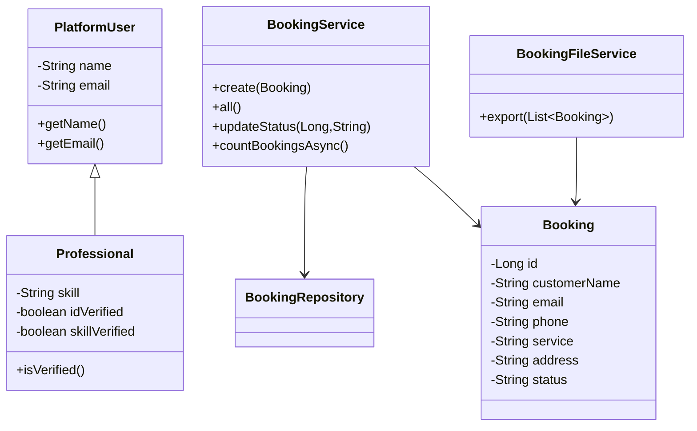

# UML Class Diagram (Mermaid)

```mermaid
classDiagram
  class PlatformUser {
    -String name
    -String email
    +getName()
    +getEmail()
  }
  class Professional {
    -String skill
    -boolean idVerified
    -boolean skillVerified
    +isVerified()
  }
  PlatformUser <|-- Professional
  class Booking {
    -Long id
    -String customerName
    -String email
    -String phone
    -String service
    -String address
    -String status
  }
  class BookingService {
    +create(Booking)
    +all()
    +updateStatus(Long,String)
    +countBookingsAsync()
  }
  class BookingRepository
  class BookingFileService {
    +export(List~Booking~)
  }
  BookingService --> BookingRepository
  BookingService --> Booking
  BookingFileService --> Booking
```
